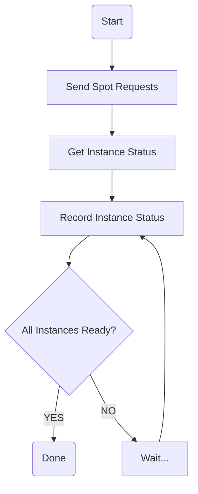

# TBD

## Collection of SPS and IF
[Spot Placement Score](https://docs.aws.amazon.com/AWSEC2/latest/UserGuide/spot-placement-score.html) (SPS) and [Interruption Frequency](https://aws.amazon.com/ec2/spot/instance-advisor/) (IF) score are two score that used to measure spot availability.

[Spotlake](https://spotlake.ddps.cloud/) has provided a comprehensive dataset. Due to the large size of the full dataset, they don't provide a real-time API to access these data. However, while [collecting instance launch time](#collect-launch-time), I figured out that I need a way to collect SPS and IF at real time, so, I turned to collect SPS and IF by myself.

### Prerequisite
* Python version == 3.11.4
* Make sure you have checked dependencies in `collect_sps_and_if/requirements.txt`.
* You have created and configured your AWS Access Key ID/AWS Secret Access Key correctly so that `boto3` can create spot instances.
* Donwnload and extract [Spotlake](https://spotlake.ddps.cloud/) dataset at `spot_dataset/aws`, the folder structure should looks like:
  ```
  spot_dataset
  |- aws
     |- aws-2024-01
     |  |- 01
     |  |  |- 00-10-00.csv
     |  |  |- 00-20-00.csv
     |  |  |- ...
     |  |- 02
     |  |  |- 00-10-00.csv
     |  |  |- ...
     |  |- ...
     |- ...
  ```
* Create required folders:
  ```Bash
  mkdir -p collect_sps_and_if/data/score collect_sps_and_if/data/sps_and_if
  ```

### File Navigation
`collect_sps_and_if/__main__.py` => Collect SPS and IF
`collect_sps_and_if/daily_score.py` => Compute score and send email notification
`collect_sps_and_if/score_by_spotlake_data.py` => Generate initial score

### SPS and Instance Selection
I collect SPS with [`get_spot_placement_scores`](https://boto3.amazonaws.com/v1/documentation/api/latest/reference/services/ec2/client/get_spot_placement_scores.html) method. The major problem here is the anti-crawler mechanism of AWS. It only allow you to send ~50 types of SPS query request every 24 hours. And on each request, you can only get SPS of **ONE** instance among all regions. Fortunately, it seems that there is no limitation of how many requests sent of each type.

As this circumstance, I need to pick those most valuable instances and query their SPS. Typically, I will based on the SPS and IF I collected in yesterday to decide which instances to collect today. I compute the score of variance of SPS and IF based on how many times they changed in a day. You can check `collect_sps_and_if/daily_score.py` to see how do I compute score everyday.

Then I find the `SPS_AND_IF_TOP_K` (can be configured) instances with the highest score with `SAMPLE_COUNT` (also configurable) of randomly slected instances and collect their SPS and IF. The random selection is like a exploration step, hope it can find some valuable instances.

At the first day of collection, I don't have any data, so I use data provided by [Spotlake](https://spotlake.ddps.cloud/) to compute an initial score. It will be saved in `collect_sps_and_if/data/init_score.csv`, to compute that, you need to run the following commands:
```Bash
python collect_sps_and_if/score_by_spotlake_data.py
```

### IF
By contrast, collecting IF is way more easy. AWS provide a site to query interruption frequency [here](https://aws.amazon.com/ec2/spot/instance-advisor/), and I found out their data is exactly comes from this link:
```
https://spot-bid-advisor.s3.amazonaws.com/spot-advisor-data.json
```
So I just simply request and collect them.

### Crontab
I collect SPS and IF in 10 minutes interval, and at the end of each day, I will compute the score based on today's data, and send an email to me for notification. The notification including those `SPS_AND_IF_TOP_K` instacnes. Check the crontab jobs below:
```Crontab
# Collecting SPS and IF
00 * * * * cd ~/spot && python -m collect_sps_and_if
10 * * * * cd ~/spot && python -m collect_sps_and_if
20 * * * * cd ~/spot && python -m collect_sps_and_if
30 * * * * cd ~/spot && python -m collect_sps_and_if
40 * * * * cd ~/spot && python -m collect_sps_and_if
50 * * * * cd ~/spot && python -m collect_sps_and_if
# Compute score at 23:55
55 23 * * * cd ~/spot && python -m collect_sps_and_if.daily_score
```

If you want to get a notification by email, you need to edit the `SMTPConfigs` in `configs.py`, and put your crendential (password) in `crendential.txt`.

## Get Instance Architecture and Available AMI ID in Each Region
When launching different instances at different regions, one of the problem is that they require different AMI ID. So, I write a script to get the architecture (x86_64, arm64) of instance family (e.g. t2, m6gn). And I also write another script get the available AMI ID at each region for each architecture (here I use Amazon Linux 2023 AMI). You can get them by yourself, or use those AMI I have already collected.

**Using Collected:** data is stored at `instance_arch_and_ami_id/__init__.py`, to get AMI ID by region and instance:
```Python
from configs import get_ami

instance = "t2.nano"
region = "ap-south-1"

ami_id = get_ami(region, instance)
```

**Get Things by Yourself:**  
+ Install dependencies:
  ```Bash
  pip install -r instance_arch_and_ami_id/requirements.txt
  ```
+ Get family architectures:
  ```Bash
  python instance_arch_and_ami_id/get_family_arch.py
  ```
  Copy and paste the printed result in `instance_arch_and_ami_id/__init__.py`, name the variable as `FAMILY_ARCH`.
+ Get AMI IDs:
  ```Bash
  python instance_arch_and_ami_id/get_ami_id.py
  ```
  Copy and paste the printed result in `instance_arch_and_ami_id/__init__.py`, name the variable as `IMAGE_ID`.

Then it is the same as **Using Collected**.

## Collection of Spot Instance Launch Time
In this Part, I want to collect the launch time of spot instances.

> Launch Time: Latency between **spot request** and **spot ready**.

### Prerequisite
* Python version == 3.11.4
* Make sure you have checked dependencies in `collect_pod_launch_time/requirements.txt`.
* You have created and configured your AWS Access Key ID/AWS Secret Access Key correctly so that `boto3` can create spot instances.
* You have done the [Collection of SPS and IF](#collection-of-sps-and-if) step.
* *(Optional)* You have [got AMI IDs](#get-instance-architecture-and-available-ami-id-in-each-region).

### File Navigation
`__main__.py` => Collect launch time

### Select Instance & Region
I collect SPS and IF by myself at 10 minutes interval. All data is stored at `collect_sps_and_if/data/sps_and_if`. At each day, I will select the `LAUNCH_TOP_K` instance and regions with the highest scores to collect their launch time.

### Collect Launch Time
The idea is to send spot requests to AWS, monitor instances until they are ready, then cancel requests & delete instances. Below is the flow chart.

The three main steps in this flow chart are **Send Spot Requests**, **Get Instance Status** and **Record Instance Status**. Below are descriptions.

**Send Spot Requests** I use the [`request_spot_instances`](https://boto3.amazonaws.com/v1/documentation/api/latest/reference/services/ec2/client/request_spot_instances.html) method from EC2 client to requests for certain number of instances in certain region. The response of this API includes `request_id`, which can help to identify instances later.

Then the program will repeat the following two steps:

**Get Instance Status** [`describe_instances`](https://boto3.amazonaws.com/v1/documentation/api/latest/reference/services/ec2/client/describe_instances.html) method provides instance IDs and how they are created. Find corresponding instances that match `request_id`, and record their instance IDs. Then [`describe_instance_status`](https://boto3.amazonaws.com/v1/documentation/api/latest/reference/services/ec2/client/describe_instance_status.html) can help to determine if an instance is ready. I query the status of instances each 3 seconds until all instances are ready.

**Record Instance Status** In each record, I put current time, number of ready instances and the launch request information. Therefore, the model can predict number of ready instances at different time.

This loop will continue until timeout (10 minutes by default) or all instances are ready. After all, the progroam will cancel all spot requests([`cancel_spot_instance_requests`](https://boto3.amazonaws.com/v1/documentation/api/latest/reference/services/ec2/client/cancel_spot_instance_requests.html)) and terminate all instances([`terminate_instances`](https://boto3.amazonaws.com/v1/documentation/api/latest/reference/services/ec2/client/terminate_instances.html)).

Try the following command to run the script! The script accepts an argument that used to specify number of instances you want to launched. Make sure you have created `collect_launch_time/data` and `collect_launch_time/log` folders before running script.

``` Bash
user@~/spot$ python -m collect_launch_time
```

### Crontab
I collect SPS and IF in 10 minutes interval, so I want to use the same interval to perform collection task. I write a crontab file to launch jobs at each 10 minutes, check below:

```Crontab
00 * * * * cd ~/spot && python -m collect_launch_time
10 * * * * cd ~/spot && python -m collect_launch_time
20 * * * * cd ~/spot && python -m collect_launch_time
30 * * * * cd ~/spot && python -m collect_launch_time
40 * * * * cd ~/spot && python -m collect_launch_time
50 * * * * cd ~/spot && python -m collect_launch_time
```
