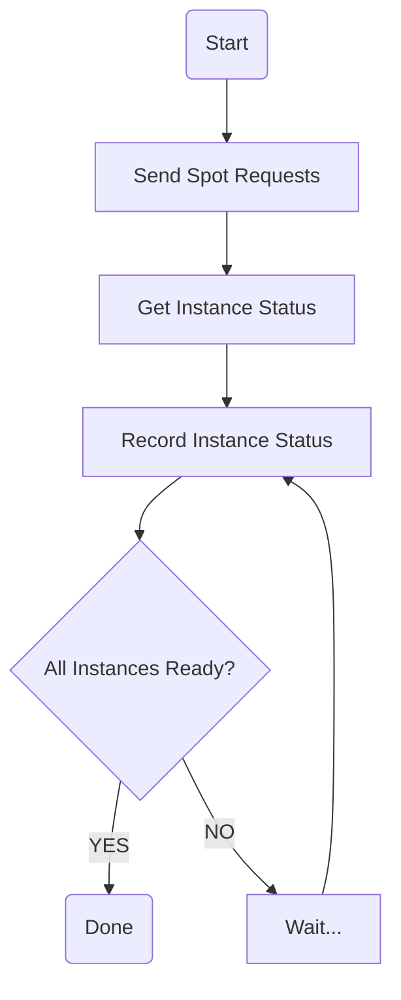

# Collection of Spot Instance Launch Time
In this Part, I want to collect the launch time of spot instances.

> Launch Time: Latency between **spot request** and **spot ready**.

Since there are hundreds of instance types and regions, I cannot collect all of instances under all regions. I decide to find out which instances under which regions are valuable to collect.

To measure the value of instances/regions, I employee the [Coefficient of Variation](https://en.wikipedia.org/wiki/Coefficient_of_variation) (CoV) of [**Spot Placement Score**](https://docs.aws.amazon.com/AWSEC2/latest/UserGuide/spot-placement-score.html) (SPS) and [**Interruption Frequency**](https://aws.amazon.com/ec2/spot/instance-advisor/) (IF). CoV represents the dynamic, higher value means more dynamic. Instances/regions with high CoV can provide more data and can benefit model training.

**!NOTES!** All path (including script execution path) in this document based on the project root folder, which is the parent of `collect_launch_time`.

## Prerequisite
* Python version == 3.11.4
* Make sure you have checked dependencies in `requirements.txt`.
* Dataset should be stored in `spot_dataset`, you can visit [SpotLake](https://spotlake.ddps.cloud/) for dataset.
* You have created and configured your AWS Access Key ID/AWS Secret Access Key correctly so that `boto3` can create spot instances.

## Select Instance & Region
[SpotLake](https://spotlake.ddps.cloud/) provides wonderful data for analyze SPS and IF, I analyze the AWS data in 2024 Aug.
```Bash
user@~/spot$ python collect_launch_time/choose_instance_region.py
```
This script will merge data and compute a score of instances of regions. Since large/xlarge/metal instance types are too expensive, I only count those medium/nano/small instances.

## Collect Launch Time
The idea is to send spot requests to AWS, monitor instances until they are ready, then cancel requests & delete instances. Below is the flow chart.

The three main steps in this flow chart are **Send Spot Requests**, **Get Instance Status** and **Record Instance Status**. Below are descriptions.

**Send Spot Requests** I use the [`request_spot_instances`](https://boto3.amazonaws.com/v1/documentation/api/latest/reference/services/ec2/client/request_spot_instances.html) method from EC2 client to requests for certain number of instances in certain region. The response of this API includes `request_id`, which can help to identify instances later.

Then the program will repeat the following two steps:

**Get Instance Status** [`describe_instances`](https://boto3.amazonaws.com/v1/documentation/api/latest/reference/services/ec2/client/describe_instances.html) method provides instance IDs and how they are created. Find corresponding instances that match `request_id`, and record their instance IDs. Then [`describe_instance_status`](https://boto3.amazonaws.com/v1/documentation/api/latest/reference/services/ec2/client/describe_instance_status.html) can help to determine if an instance is ready. I query the status of instances each 3 seconds until all instances are ready.

**Record Instance Status** In each record, I put current time, number of ready instances and the launch request information. Therefore, the model can predict number of ready instances at different time.

This loop will continue until timeout (10 minutes by default) or all instances are ready. After all, the progroam will cancel all spot requests([`cancel_spot_instance_requests`](https://boto3.amazonaws.com/v1/documentation/api/latest/reference/services/ec2/client/cancel_spot_instance_requests.html)) and terminate all instances([`terminate_instances`](https://boto3.amazonaws.com/v1/documentation/api/latest/reference/services/ec2/client/terminate_instances.html)).

Try the following command to run the script! The script accepts an argument that used to specify number of instances you want to launched. Make sure you have created `collect_launch_time/data/collected` and `collect_launch_time/log` folders before running script.

``` Bash
user@~/spot$ python collect_launch_time/collect.py NUM_OF_INSTANCES
```
